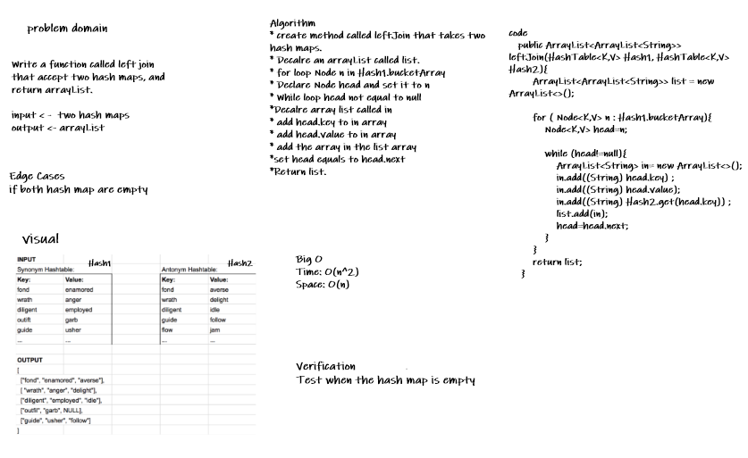

# Hashmap LEFT JOIN
<!-- Short summary or background information -->
Is an example of a join algorithm and is used in the implementation of a relational database management system.
## Challenge
<!-- Description of the challenge -->
Write a function called left join that accept two hash maps, and return arrayList.

input < -  two hash maps
output <- arrayList
## Approach & Efficiency
<!-- What approach did you take? Why? What is the Big O space/time for this approach? -->
Time complexity -> O(n^2) because of use while loop inside for loop
Space complexity -> O(n) because of using new array list 

## Solution
<!-- Embedded whiteboard image -->
