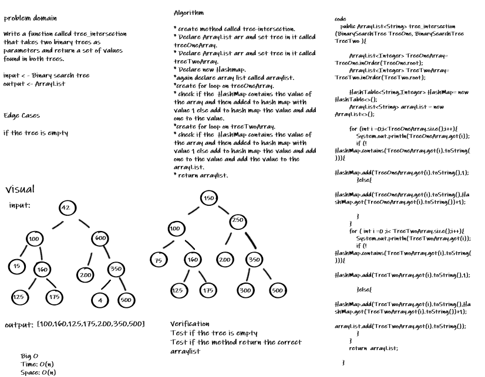

# Challenge Summary
<!-- Description of the challenge -->
Write a function called tree_intersection that takes two binary trees as parameters and return a set of values found in both trees.
## Whiteboard Process
<!-- Embedded whiteboard image -->

## Approach & Efficiency
<!-- What approach did you take? Why? What is the Big O space/time for this approach? -->
time complexity - > O(n) because I used for loop to search and add the values from the arrays.
Space complexity -> O(n) because I used new arrayList.
## Solution
<!-- Show how to run your code, and examples of it in action -->
##### Input:
* Tree One -> [75, 100, 125, 150, 160, 175, 200, 250, 300, 350]
* Tree Two -> [15, 42, 100, 125, 160, 175, 200, 350, 500, 600]

##### Output: [100, 125, 160, 175, 200, 350]