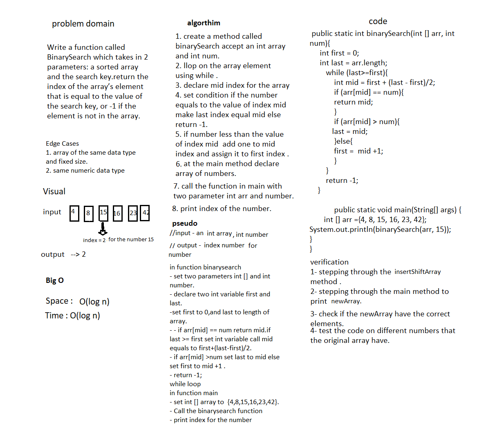

# Binary Search
Write a function called BinarySearch which takes in 2 parameters: a sorted array and the search key.return the index of the array’s element that is equal to the value of the search key, or -1 if the element is not in the array.

Input |	Output
------ | --------
[4, 8, 15, 16, 23, 42], 15 |	2
[-131, -82, 0, 27, 42, 68, 179], 42 |	4
[11, 22, 33, 44, 55, 66, 77], 90	| -1
[1, 2, 3, 5, 6, 7], 4	 | -1

## Whiteboard Process

## Approach & Efficiency
i creat a binary search to find the index of the number insid the array it is much quicker becauseit breaks the array down in half rather than sequentially traversing through the array elements also it's Better time complexity and thus takes less compilation time. 
space O(log n)
time O(log n)
