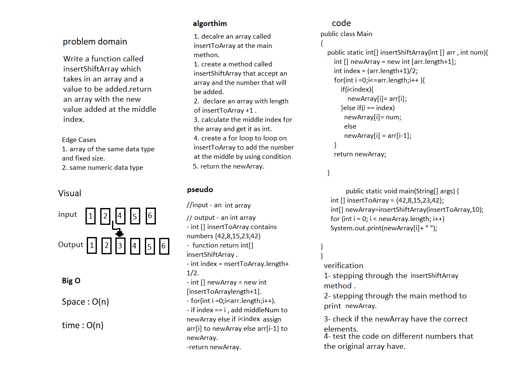

# insert Shift Array
Write a function called insertShiftArray which takes in an array and a value to be added and return an array with the new value added at the middle index.
Input |	Output
------ | --------
[2,4,6,-8], 5 |	[2,4,5,6,-8]
[42,8,15,23,42], 16	 | [42,8,15,16,23,42]

## Whiteboard Process

## Approach & Efficiency
The approach i take is by create a new array and for loop and set values based on condition , i use this way because for loop help to track the index of the array and can control in all the data inside the array also to ranking them.
space O(n)
time O(n)