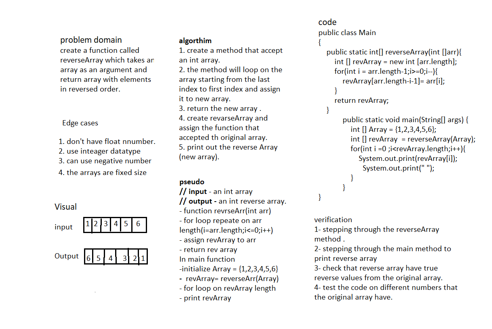

# Reverse an Array
Write a function called reverseArray which takes an array as an argument and return array with elements in reverse oreder.
Input |	Output
------ | --------
[1, 2, 3, 4, 5, 6] |	[6, 5, 4, 3, 2, 1]
[89, 2354, 3546, 23, 10, -923, 823, -12] |	[-12, 823, -923, 10, 23, 3546, 2354, 89]

## Whiteboard Process

## Approach & Efficiency
The approach i take is by using for loop and make the starting number from the last index of the array, i use this way because i think is simple and don't edit the original array.
space O(n)
time O(1)

