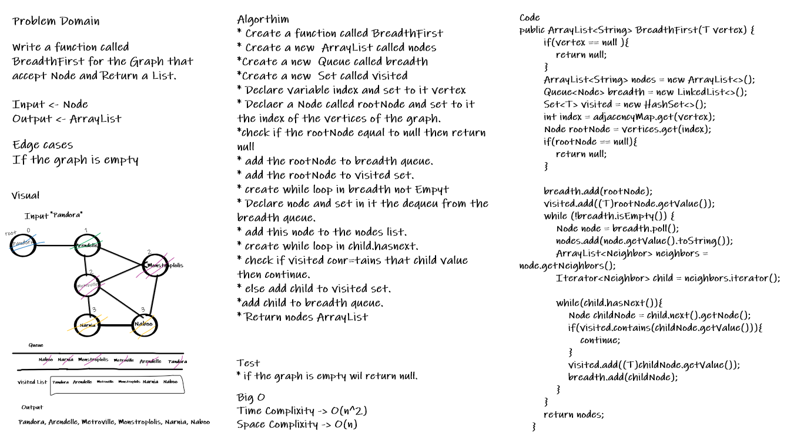
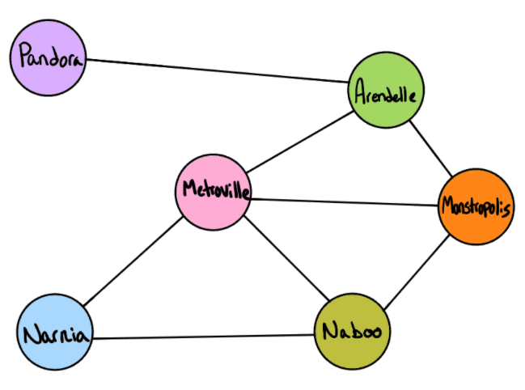

# Graphs
<!-- Short summary or background information -->
Graphs non-linear data structure consisting of nodes and edges. The nodes are sometimes also referred to as vertices and the edges are lines or arcs that connect any two nodes in the graph. used to represent the connection between pairs of objects.
## Challenge
<!-- Description of the challenge -->
Implement Graph that represented as an adjacency list, and should include the following methods:
1. add node
     * Arguments: value
     * Returns: The added node
     * Add a node to the graph
2. add edge
     * Arguments: 2 nodes to be connected by the edge, weight (optional)
     * Returns: nothing
     * Adds a new edge between two nodes in the graph
     * If specified, assign a weight to the edge
     * Both nodes should already be in the Graph
3. get nodes
   * Arguments: none
   * Returns all the nodes in the graph as a collection (set, list, or similar)
4. get neighbors
   * Arguments: node
   * Returns a collection of edges connected to the given node
   * Include the weight of the connection in the returned collection
5. size
   * Arguments: none
   * Returns the total number of nodes in the graph

## Approach & Efficiencyet
<!-- What approach did you take? Why? What is the Big O space/time for this approach? -->

* addNode() -> Time complexity: O(1), Space complexity -> O(n)
* addEdge() -> Time complexity: O(1), Space complexity -> O(n)
* getNodes() -> Time complexity: O(1), Space complexity -> O(1)
* getNeighbors() -> Time complexity: O(1), Space complexity -> O(1)
* size() -> Time complexity: O(1), Space complexity -> O(1)

## API
<!-- Description of each method publicly available in your Graph -->
1. addNode method : Accept an Arg Value, Returns The added node. This method will add a node to the graph.
2. addEdge method : Have 3 Arguments 2 nodes to be connected by the edge and weight, Return nothing> This method will add undirected edges between the nodes.
3. getNodes method : Accept none and Return  all the nodes in the graph as a Set collection.
4. size method : Accept none and Return the total number of nodes in the graph.

# Challenge Summary
<!-- Description of the challenge -->
Write a function called BreadthFirst for the Graph that accept Node and Return a List.

## Whiteboard Process
<!-- Embedded whiteboard image -->

## Approach & Efficiency
<!-- What approach did you take? Why? What is the Big O space/time for this approach? -->
Big O
Time Complixity -> O(n^2) because of using nested loop
Space Complixity -> O(n) because of initialize new Arraylist 
## Solution
<!-- Show how to run your code, and examples of it in action -->

* Input: graph.BreadthFirst("Pandora")

* Output :[Pandora, Arendelle, Metroville, Monstroplolis, Narnia, Naboo]
