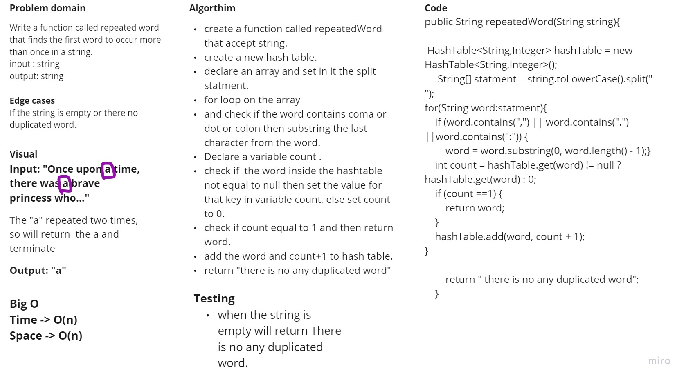

# Hashtables
<!-- Short summary or background information -->
**Hash Table** is a data structure which stores data in an associative manner. In a hash table, data is stored in an array format, where each data value has its own unique index value. Access of data becomes very fast if we know the index of the desired data.
## Challenge
<!-- Description of the challenge -->
#### Implement a Hashtable Class with the following methods:
1. add method contain Arguments key and value, returns nothing, this method should hash the key, and add the key and value pair to the table, handling collisions as needed.
2. get method contain Arguments key and returns  Value associated with that key in the table.
3. contains method contain Arguments key and returns Boolean, indicating if the key exists in the table already.
4. hash method contain Arguments key and returns Index in the collection for that key.
#### Testing:
1. Adding a key/value to your hashtable results in the value being in the data structure
2. Retrieving based on a key returns the value stored
3. Successfully returns null for a key that does not exist in the hashtable 
4. Successfully handle a collision within the hashtable 
5. Successfully retrieve a value from a bucket within the hashtable that has a collision 
6. Successfully hash a key to an in-range value
## Approach & Efficiency
<!-- What approach did you take? Why? What is the Big O space/time for this approach? -->

* Time and space complexity for add method are Time -> O(n) & Space -> Best Case: O(1), The Worst Case: O(n)
* Time and space complexity for contains method are Time -> O(n) & Space -> Best Case: O(1), The Worst Case: O(n)
* Time and space complexity for get method are Time -> O(n) & Space -> Best Case: O(1), The Worst Case: O(n)
* Time and space complexity for hash method are Time -> O(1) & Space ->  O(1)

## API
<!-- Description of each method publicly available in each of your hashtable -->

* add() method contain Arguments key and value, returns nothing, this method should hash the key, and add the key and value pair to the table, handling collisions as needed.
* get() method contain Arguments key and returns  Value associated with that key in the table. 
* contains() method contain Arguments key and returns Boolean, indicating if the key exists in the table already.
* hash() method contain Arguments key and returns Index in the collection for that key.
* isEmpty() to check if the array is empty or not,Return Boolean 

# hashmap-repeated-word
# Challenge Summary
<!-- Description of the challenge -->
Write a function called repeated word that finds the first word to occur more than once in a string.
Input : string, output: string
## Whiteboard Process
<!-- Embedded whiteboard image -->

## Approach & Efficiency
<!-- What approach did you take? Why? What is the Big O space/time for this approach? -->
The Time complexity -> O(n) because I used for loop
The Space complexity -> O(n) because declare a new hash table.
## Solution
<!-- Show how to run your code, and examples of it in action -->
* **Input:**  -> "Once upon a time, there was a brave princess who..."
*  **Output:** -> "a"