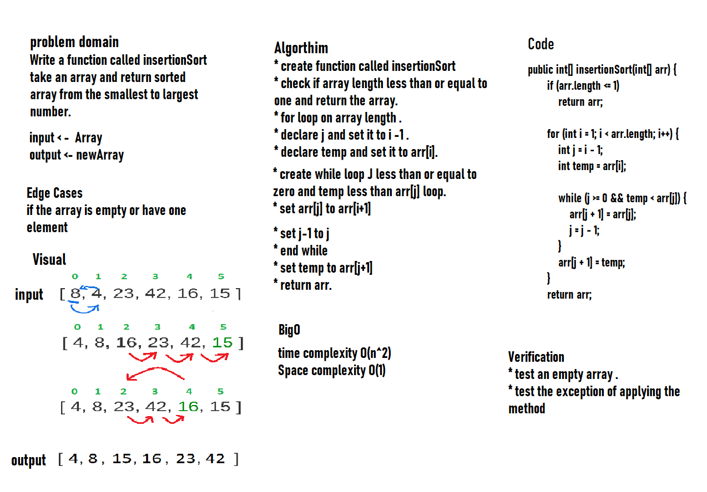

# Challenge Summary
<!-- Description of the challenge -->
Write a function called insertionSort take an array and return sorted array from the smallest to the largest number.
## Whiteboard Process
<!-- Embedded whiteboard image -->

## Approach & Efficiency
<!-- What approach did you take? Why? What is the Big O space/time for this approach? -->
#### Big O:
* Time complexity -> O(n^2) because we have while loop inside for loop O(n*n) -> O(n^2)
* Space complexity -> O(1)  constant,  No additional space is being created.
## Solution
<!-- Show how to run your code, and examples of it in action -->

* input : array {8, 4, 23, 42, 16, 15} 
* output: array {4, 8, 15, 16, 23, 42}