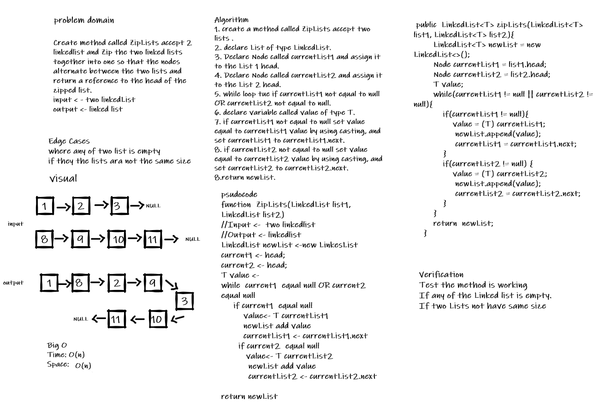

# Singly Linked List
It's a collection of nodes contains some values and a pointer to the next node of the same data type.
* Head points to the first node.
* Last node points to NULL.
* Singly linked list allows traversal elements only in one way.

## Challenge
* Create Node class and Linked List class that should contain following methods:

Method | Description
-------- | ----------
insert | method for adding values into Linked List
includes | methode used to check on value if it is included in the Linked List or not
toString | used to return the collection of the Linked List

* write seven testing methods to prove the following functionality:
1. Can successfully instantiate an empty linked list
2. Can properly insert into the linked list
3. The head property will properly point to the first node in the linked list
4. Can properly insert multiple nodes into the linked list
5. Will return true when finding a value within the linked list that exists
6. Will return false when searching for a value in the linked list that does not exist
7. Can properly return a collection of all the values that exist in the linked list

## Approach & Efficiency
* create a Linked List based on an initial node which is the head.
* create simple method for insert by declare a new node and make point to the head.
  I use this approach because the time and space complexity is **O(1)**.
* using while loop that check if the node not equal to null and next of type node to stepping at the Linked List.
  **Time -> O(n) Space -> O(1)**
* time and space complexity for insert method are **Time -> O(1) & Space -> O(1)** 
* time and space complexity for includes method are **Time -> O(n) & Space -> O(1)**
* time and space complexity for toString method are **Time -> O(n) & Space -> O(1)**

## API
1. insert(value) - accept value and add it to the first of the linked list and return nothing.

2. includes(value) - accept one parameter which is the value, and return true if the value is exist in the list and false if it is not exist.

3. toString() - method that return String collection of the linked list as following format:

> "{ a } -> { b } -> { c } -> NULL"

----------
# Append
# Challenge Summary
Create a method named Append that accept new value, and adds a new node with the given value to the end of the list

## Whiteboard Process

## Approach & Efficiency
use one while loop to move to last node, **Time = O(n) , space O(1)** .

## Solution
input : 12 -> add 12 to the end
the list before : { 8 } -> { 9 } -> { 11 } -> NULL
list after append 12 to the end : { 8 } -> { 9 } -> { 11 } -> { 12 } -> NULL

# Insert Before
# Challenge Summary
Create a method named insertBefore that accept selected node value and new value, and adds a new node with the given value before selected node value.

## Whiteboard Process

## Approach & Efficiency

Can successfully insert a node before a node located i the middle of a linked list.
Can successfully insert a node before the first node of a linked list.
**Time = O(n) , space O(1)**

## Solution
Example 1:
input : (12,111) ->  add 111 before 12
the list before :  { 9 } -> { 10 } -> { 11 } -> { 12 } -> NULL
list after append 12 to the end :  { 9 } -> { 10 } -> { 11 } -> { 111 } -> { 12 } -> NULL

Example 2:
input : (9,8) ->  add 8 before 9 (head node) 
the list before : { 9 } -> { 10 } -> { 11 } -> { 12 } -> NULL
list after append 12 to the end : { 8 } -> { 9 } -> { 10 } -> { 11 } -> { 111 } -> { 12 } -> NULL

# Insert After
# Challenge Summary
Create a method named insertAfter that accept selected node value and new value,
and adds a new node with the given value after selected node value.

## Whiteboard Process

## Approach & Efficiency

Can successfully insert after a node in the middle of the linked list.
Can successfully insert a node after the last node of the linked list
**Time = O(n) , space O(1)**

## Solution
Example 1:
input : (12,13) ->  add 13 after 12
the list before : { 8 } -> { 9 } -> { 10 } -> { 11 } -> { 12 } -> NULL
list after append 12 to the end :  { 8 } -> { 9 } -> { 10 } -> { 11 } -> { 12 } -> { 13 } -> NULL

Example 2:
input : (9,99) ->  add 99 after 9 
the list before :{ 8 } -> { 9 } -> { 10 } -> { 11 } -> { 12 } -> NULL
list after append 12 to the end : { 8 } -> { 9 } -> { 99 } -> { 10 } -> { 11 } -> { 12 } -> NULL

# kthFromEnd
# Challenge Summary
Create method called kthFromEnd accept a number k as a parameter and 
return the node’s value that is k places from the tail of the linked list.

## Whiteboard Process

## Approach & Efficiency
<!-- What approach did you take? Why? What is the Big O space/time for this approach? -->
Use for loop to start the index from the end of the list and use size to know the length of the list.

**The Space -> O(1) , Time -> O(n).**

## Solution
<!-- Show how to run your code, and examples of it in action -->

* // If the Linked list is empty  ( NULL )
   * input -> ll.kthFromEnd(3)
   * Output -> The List is Empty

* // if the Linked list have one node and k =0 
  * input ->  { 2 } -> NULL , ll.kthFromEnd(0) 
  * Output -> value=2
 

* // if k value grater than the Linked list length
    * input ->  { 3 } -> { 8 } -> { 2 } -> NULL , ll.kthFromEnd(8)
    * Output -> Exception: the value 8 is out of the linked list Boundary
    

* // if k value same to Linked list length
   * input ->  { 3 } -> { 8 } -> { 2 } -> NULL , ll.kthFromEnd(3)
   * Output -> Exception: the value 3 is out of the linked list Boundary
   
* // if k value is not a positive integer
  * input ->  { 3 } -> { 8 } -> { 2 } -> NULL , ll.kthFromEnd(-1)
  * Output -> Exception: the value -1 is out of the linked list Boundary 
  
* // Happy Path where k is not at the end, but somewhere in the middle of the linked list
   * input ->  { 1 } -> { 3 } -> { 8 } -> { 2 } -> NULL , ll.kthFromEnd(2)
   * Output -> value=3

# zipLists
# Challenge Summary
<!-- Description of the challenge -->
Zip the two linked lists together into one so that the nodes alternate between the two
lists and return a reference to the head of the zipped list.

## Whiteboard Process

## Approach & Efficiency
<!-- What approach did you take? Why? What is the Big O space/time for this approach? -->
Use newList and append the values inside it by using one  while loop to loop on the nodes in two list.
**space -> O(n)**
**Time -> O(n)**

## Solution
<!-- Show how to run your code, and examples of it in action -->
* LinkedList.zipLists(List1,List2));

input :
  * { 10 } -> { 11 } -> { 12 } -> NULL
  * { 9 } -> { 3 } -> { 4 } -> { 55 } -> { 90 } -> { 40 } -> NULL

Output :{ 10 } -> { 9 } -> { 11 } -> { 3 } -> { 12 } -> { 4 } -> { 55 } -> { 90 } -> { 40 } -> NULL

// if one of the lists are Empty
input :
* NULL
* { 9 } -> { 3 } -> { 4 } ->  NULL

Output : { 9 } -> { 3 } -> { 4 } ->  NULL