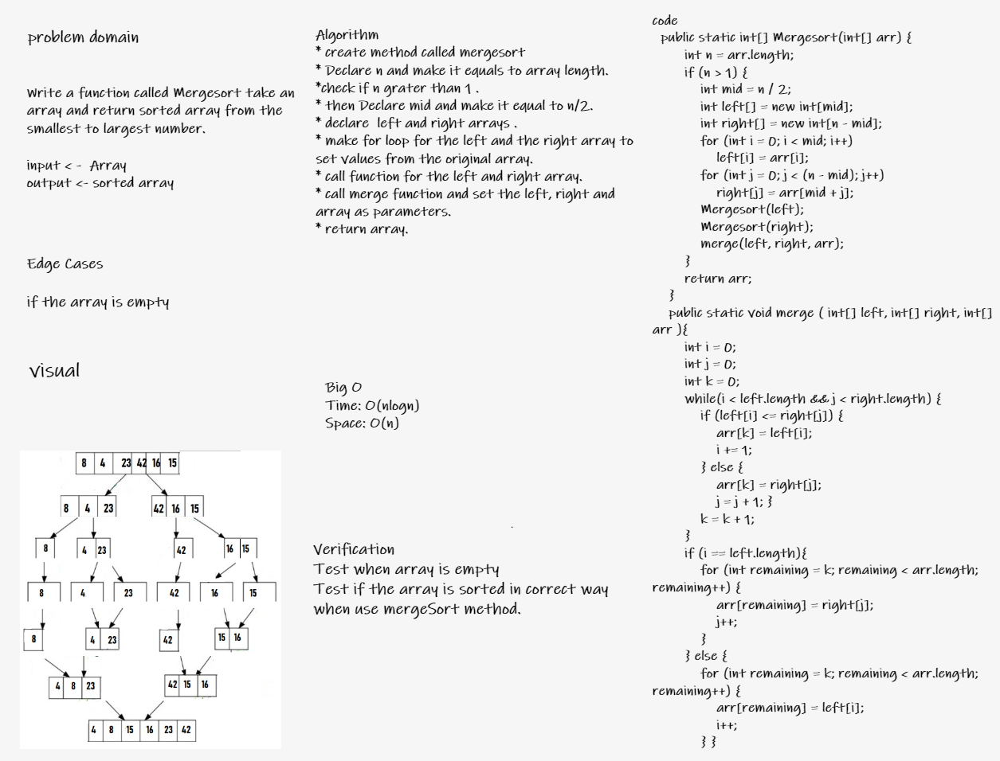

# Challenge Summary
<!-- Description of the challenge -->
Write a function called Mergesort take an array and return sorted array from the smallest to largest number.
input < -  Array
output <- sorted array
## Whiteboard Process
<!-- Embedded whiteboard image -->

## Approach & Efficiency
<!-- What approach did you take? Why? What is the Big O space/time for this approach? -->
* The approach for merge sort is Divide and Conquer.
* Time complexity -> O(n log n) because Merge Sort always divides the array into two halves and takes linear time to merge two halves.
* Space complexity -> O(n)  because of the arrays' initialization.

## Solution
<!-- Show how to run your code, and examples of it in action -->
* **Input: array {38,27,43,3,9,82,10}**

* **Output: array {4, 8, 15, 16, 23, 42}**