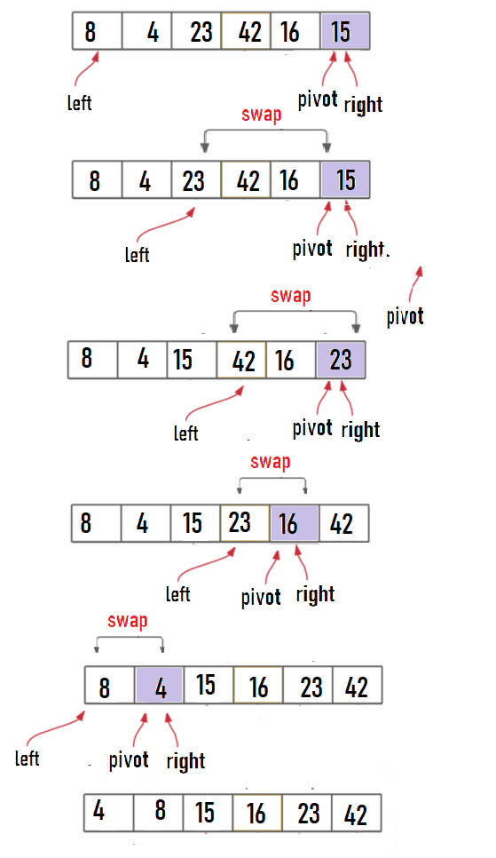

## Quick Sort
QuickSort is a Divide and Conquer algorithm. It picks an element as pivot and partitions the given array around the picked pivot

## Pseudocode

```
ALGORITHM QuickSort(arr, left, right)
    if left < right
        // Partition the array by setting the position of the pivot value
        DEFINE position <-- Partition(arr, left, right)
        // Sort the left
        QuickSort(arr, left, position - 1)
        // Sort the right
        QuickSort(arr, position + 1, right)

ALGORITHM Partition(arr, left, right)
    // set a pivot value as a point of reference
    DEFINE pivot <-- arr[right]
    // create a variable to track the largest index of numbers lower than the defined pivot
    DEFINE low <-- left - 1
    for i <- left to right do
        if arr[i] <= pivot
            low++
            Swap(arr, i, low)

     // place the value of the pivot location in the middle.
     // all numbers smaller than the pivot are on the left, larger on the right.
     Swap(arr, right, low + 1)
    // return the pivot index point
     return low + 1

ALGORITHM Swap(arr, i, low)
    DEFINE temp;
    temp <-- arr[i]
    arr[i] <-- arr[low]
    arr[low] <-- temp
      
```
## Trace
**Input: array {8, 4, 23, 42, 16, 15}**

* First determine the povit, left and right.
* shift left pointer untile the value of arr[left] grater than pivot.
* shift the right pointer to find a value of arr[right]  less than the povit.
* swap the values at the pointers between left value and right value.
* Repeat untile all pointer meet or cross.


#### Step 1


**Output: array {4, 8, 15, 16, 23, 42}**

### Efficency:
* Time complexity -> 
    * Best Case: T(n)= 2T(n/2)+ ?(n). Time complexity: O(n*logn),
Best case occurs when a middle element is chosen as a pivot. It means a number of elements smaller than pivot are equal to the number of elements greater than the pivot.
    * Average Case: T(n)= T(n/3)+T(2n/3)+ ?(n). Time complexity: O(n*logn),
     Average case can be considered when partition puts O(n/3) elements in one set and O(2n/13) elements in other set.
    * Worst Case: T(n)= T(n-1)+ ?(n). Time complexity: O(n*n), worst case occurs when all elements of given array are smaller than pivot or larger than pivot. Ex- Suppose array is already sorted and we choose the last element as a pivot.
* in my case the Time Complixity is O(n*logn).
* Space complexity -> Is calculated based on the space used in the recursion stack. The worst case space used will be O(n). where getting a sorted list, we need to make n recursive calls.
* in my case the Space Complixity is O(1).