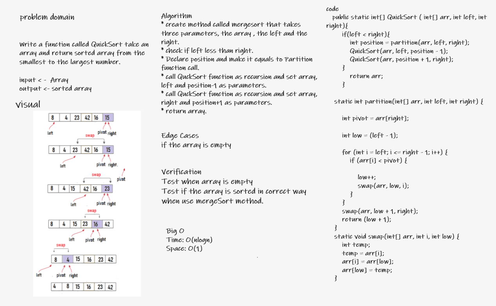

# Challenge Summary
<!-- Description of the challenge -->
Write a function called QuickSort take an array and return sorted array from the smallest to the largest number.
## Whiteboard Process
<!-- Embedded whiteboard image -->

## Approach & Efficiency
<!-- What approach did you take? Why? What is the Big O space/time for this approach? -->

* Time complexity -> 
    * Best Case: T(n)= 2T(n/2)+ ?(n). Time complexity: O(n*logn),
Best case occurs when a middle element is chosen as a pivot. It means a number of elements smaller than pivot are equal to the number of elements greater than the pivot.
    * Average Case: T(n)= T(n/3)+T(2n/3)+ ?(n). Time complexity: O(n*logn),
     Average case can be considered when partition puts O(n/3) elements in one set and O(2n/13) elements in other set.
    * Worst Case: T(n)= T(n-1)+ ?(n). Time complexity: O(n*n), worst case occurs when all elements of given array are smaller than pivot or larger than pivot. Ex- Suppose array is already sorted and we choose the last element as a pivot.
* in my case the Time Complixity is O(n*logn).
* Space complexity -> Is calculated based on the space used in the recursion stack. The worst case space used will be O(n). where getting a sorted list, we need to make n recursive calls.
* in my case the Space Complixity is O(1).

## Solution
<!-- Show how to run your code, and examples of it in action -->
* **Input: array {8 ,4 ,23 ,42 ,16 ,15}**

* **Output: array {4, 8, 15, 16, 23, 42}**