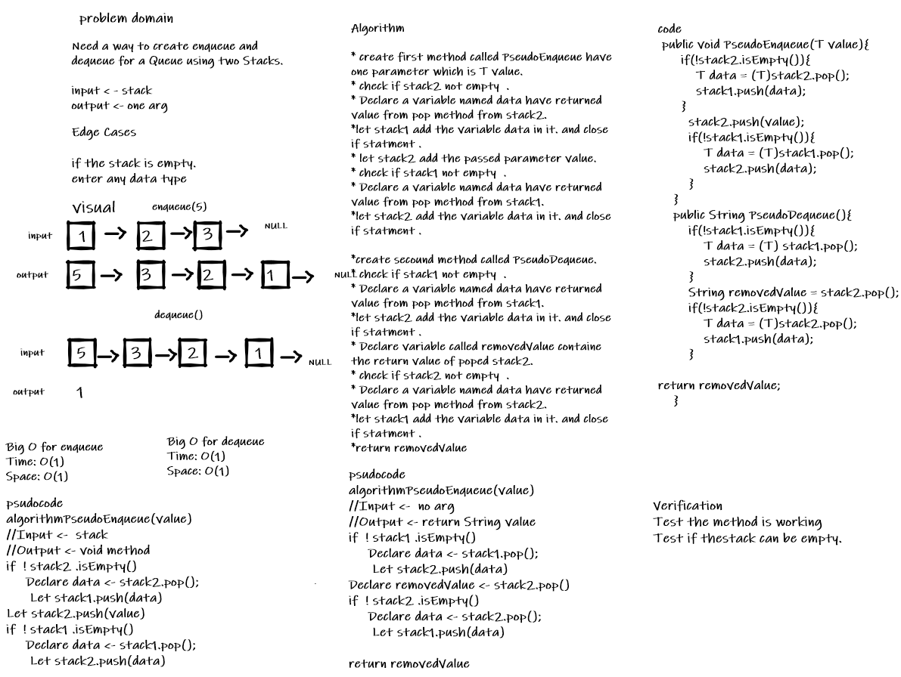
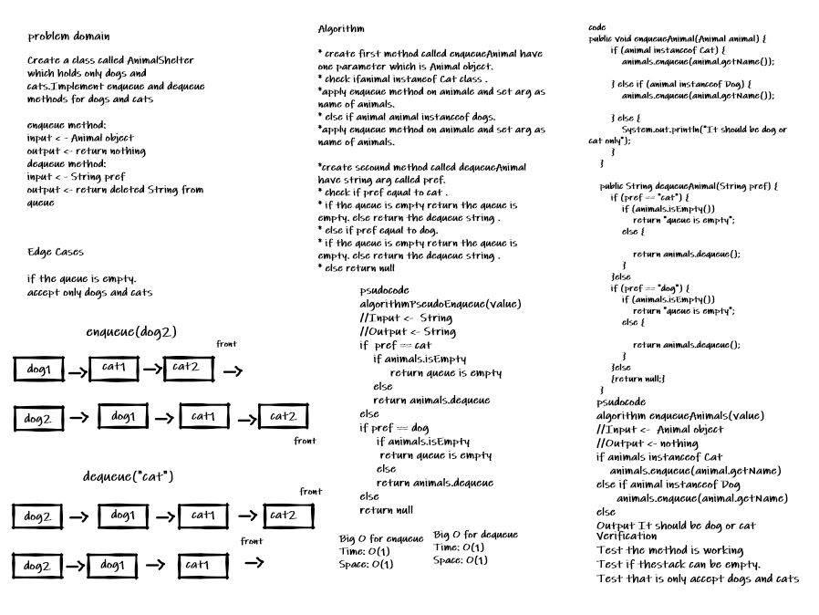
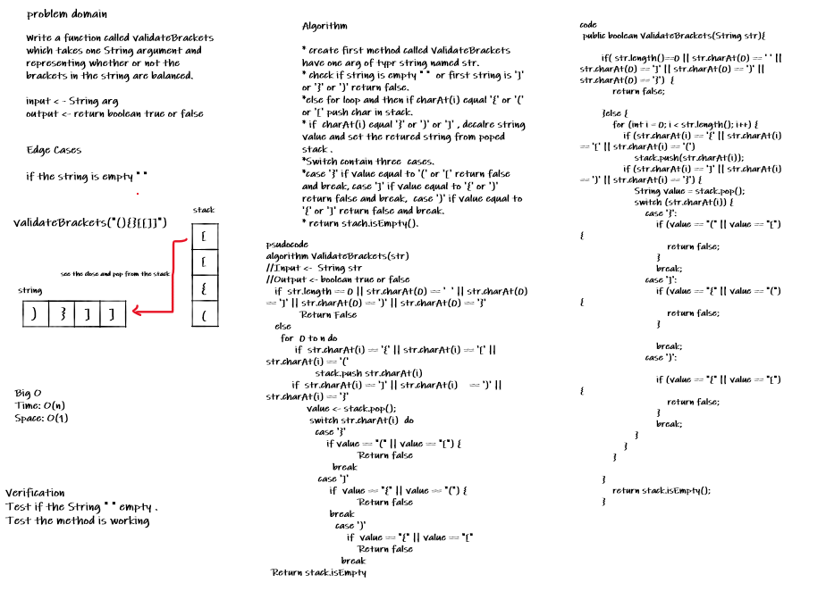

# Stacks and Queues
* A Stack is a linear data structure or container of objects that are inserted and removed according to the last-in first-out (LIFO) principle or First-In Last-Out (FILO) principle, that mean the sequential access is only possible.

* A Queue is a container of objects (a linear collection) that are inserted and removed according to the first-in first-out (FIFO) and (LILO) Last-In Last-Out principle

## Challenge
<!-- Description of the challenge -->
create Stack class has a top property. It creates an empty Stack when instantiated.
The class should contain the following methods: push,pop,peek and isEmpty.

create Stack class has a front property. It creates an empty Queue when instantiated.
The class should contain the following methods: enqueue, dequeue, peek, isEmpty.

## Approach & Efficiency
<!-- What approach did you take? Why? What is the Big O space/time for this approach? -->
For all the method in Stack and Queue take same time and space complexity which is :
**Time -> O(1)**
**Space -> O(1)**

## API
<!-- Description of each method publicly available to your Stack and Queue-->
#### Stack method :
* push(x): used to insert node at the top of the stack (pushed), we need to pass element that want to be bushed .
* pop() : used to delete node from the top of the stack and we don't pass an arg. it checked if the stack is empty or not before conducting a pop to ensure that an exception is not raised.
* Peek(): function just returns the value of the top element available in the stack. it checked  if the stack is empty or not before conducting a peek to ensure that an exception is not raised.
* isEmpty() : this function will return a true value if the stack is empty or otherwise it will return a false value.

#### Queue method :
* enqueue(x) - used to add node at the rear of the queue,  need to pass arg that want to be added .
* dequeue() - used to delete node from the queue and don't need to pass an arg. it checked if the stack is empty or not before conducting a Dequeue to ensure that an exception is not raised.
* Peek() - function just returns the value of the Front element available in the queue. it checked if the queue is empty or not before conducting a peek to ensure that an exception is not raised.
* isEmpty() - returns true when queue is empty otherwise returns false.

## stack-queue-pseudo
# Challenge Summary
<!-- Description of the challenge -->
Need a way to create enqueue and dequeue for a Queue using two Stacks.
## Whiteboard Process
<!-- Embedded whiteboard image -->

## Approach & Efficiency
<!-- What approach did you take? Why? What is the Big O space/time for this approach? -->
Create two method enqueue and dequeue by using two stack .
The complexity for enqueue  **time -> O(1) and Space -> O(1)**
The complexity for dequeue **time -> O(1) and Space -> O(1)**
## Solution
<!-- Show how to run your code, and examples of it in action -->
* pseudoEnqueue(value)
   * Input	[10]->[15]->[20] 
   * Args 5 
   * Output [5]->[10]->[15]->[20]
   * 
* dequeue()
   * Input	[5]->[10]->[15]->[20]
   * Output [5]->[10]->[15]

# First-in, First out Animal Shelter.
# Challenge Summary
<!-- Description of the challenge -->
Create a class called AnimalShelter which holds only dogs and cats.Implement enqueue and dequeue methods for dogs and cats

## Whiteboard Process
<!-- Embedded whiteboard image -->

## Approach & Efficiency
<!-- What approach did you take? Why? What is the Big O space/time for this approach? -->
The shelter operates using a first-in, first-out approach.
**for enqueue method  Big O :  space -> O(1) , time -> O(1).**
**for enqueue method  Big O :  space -> O(1) , time -> O(1).**

## Solution
<!-- Show how to run your code, and examples of it in action -->
##### enqueueAnimal(dog2)
 input   	[dog1] -> [cat1] -> [cat2] -> 

output     [dog2] ->  [dog1] -> [cat1] -> [cat2] -> 

##### dequeueAnimal(dog2)
input   	[dog2] ->  [dog1] -> [cat1] -> [cat2] ->

output     [dog2] ->  [dog1] -> [cat1] -> 

#  Validate Brackets 
# Challenge Summary
<!-- Description of the challenge -->
Write a function called validateBrackets
which takes one String argument and representing whether or not the brackets in the string are balanced.
## Whiteboard Process
<!-- Embedded whiteboard image -->

## Approach & Efficiency
<!-- What approach did you take? Why? What is the Big O space/time for this approach? -->
Use Stack to reduce time complexity and space.
**Method complexity :  space -> O(1) , time -> O(n)**

## Solution
<!-- Show how to run your code, and examples of it in action -->
##### validateBrackets("(){}[[]]")
* input -> (){}[[]]
* output ->  true

##### validateBrackets(")")
* input -> )
* output ->  false
