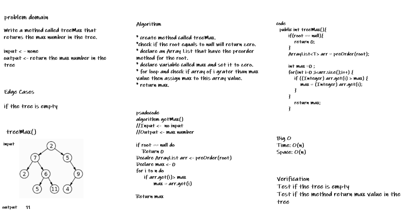
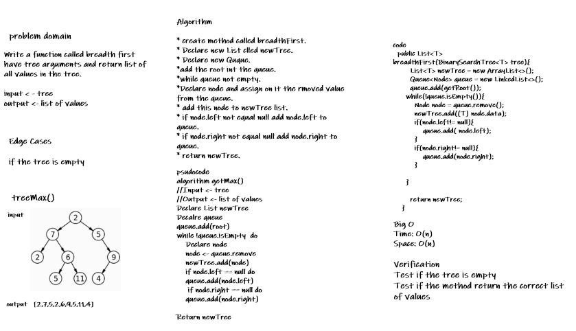
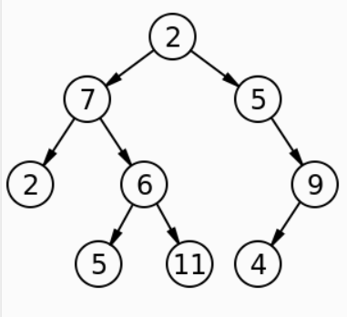
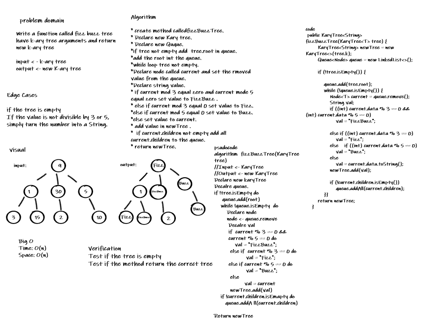

# Trees
<!-- Short summary or background information -->
* Trees are Data structures used to store and organize data.
* Trees are a collection of nodes, and they are linked with edges (pointers), representing the hierarchical connections between the nodes.
* Trees are non-linear data structures.

## Challenge
<!-- Description of the challenge -->
1. Create a Binary Tree that have three method for each of the depth first traversals: 
preOrder, inOrder and postOrder which returns an array of the values, ordered appropriately.
2. Create a Binary Search Tree that is subclass of Binary Tree and have two methods which are 
add method have value as arg and return nothing and Contains have value as arg and return boolean 
3. indicating whether or not the value is in the tree at least once

## Approach & Efficiency
<!-- What approach did you take? Why? What is the Big O space/time for this approach? -->

Big O for the methods :

* preOrder: time -> O(n) because traverse each node once,the amount of work for each node is constant(c) (does not depend on the rest of the nodes), Space ->O(n) use an ArrayList
* inOrder: time -> O(n) because traverse each node once, the amount of work for each node is constant(c) (does not depend on the rest of the nodes) , Space ->O(n) use an ArrayList 
* postOrder: time -> O(n) because traverse each node once, the amount of work for each node is constant(c) (does not depend on the rest of the nodes), Space ->O(n) use an ArrayList

* add : time -> O(n) because I used while loop  , Space ->O(1) constant(c)
* contains:  time -> O(n) because I used while loop , Space ->O(1) constant(c)
## API
<!-- Description of each method publicly available in each of your trees -->
* Methods for depth first traversal:
1. preOrder: return an array list for the tree as root » left » right
2. inOrder: return an array list for the tree as  left » root » right
3. postOrder: return an array list for the tree as  left » right » root
* add(value) : method that accept value as arg and return nothingm this method will adds a new node
with that value in the correct location in the binary search tree.
* contains(value): method that accept value as arg and return boolean indicating whether or not the value is in the tree at least once


# Tree Max
# Challenge Summary
<!-- Description of the challenge -->
Write a method called treeMax that returns the max number in the tree.
## Whiteboard Process
<!-- Embedded whiteboard image -->

## Approach & Efficiency
<!-- What approach did you take? Why? What is the Big O space/time for this approach? -->
#### I used an ArrayList to hold the nodes and get the max number.
Big O:
time -> O(n) - because of using the for loop witch need n times to loop,(n) represent the number of times the loop is to be executed.
Space -> O(n) - because that i use an ArrayList 
## Solution
<!-- Show how to run your code, and examples of it in action -->
* Binary tree have the following nodes : [10, 5, 7, 9, 30, 11]
* Output -> tree.treeMax() -> 30

# tree-breadth-first

# Challenge Summary
<!-- Description of the challenge -->
Write a function called breadth first have tree arguments and return list of all values in the tree, in the order they were encountered
## Whiteboard Process
<!-- Embedded whiteboard image -->


## Approach & Efficiency
<!-- What approach did you take? Why? What is the Big O space/time for this approach? -->
Big O:
Time Complexity: O(n) I use while loop , where n is the number of nodes in the binary tree 
Space Complexity: O(n) -> because i use new List and new queue O(2n)->O(n)
## Solution
<!-- Show how to run your code, and examples of it in action -->

```
BinarySearchTree<Integer>tree = new BinarySearchTree<>();
tree.add(10);
tree.add(5);
tree.add(15);
tree.add(30);
tree.add(7);
tree.add(22);
tree.breadthFirst(tree) -> [10, 5, 15, 7, 30, 22]

```

Example: 
* input ->tree  


* Output -> [2,7,5,2,6,9,5,11,4]

# fizz buzz tree

# Challenge Summary
<!-- Description of the challenge -->
Write a function called fizz buzz tree have k-ary tree arguments and return new k-ary tree, the values modified as follows:
* If the value is divisible by 3, replace the value with “Fizz”
* If the value is divisible by 5, replace the value with “Buzz”
* If the value is divisible by 3 and 5, replace the value with “FizzBuzz”
* If the value is not divisible by 3 or 5, simply turn the number into a String.

## Whiteboard Process
<!-- Embedded whiteboard image -->


## Approach & Efficiency
<!-- What approach did you take? Why? What is the Big O space/time for this approach? -->
Big O:
* Time Complexity: O(n) I use while loop , where n is the number of nodes in the binary tree
* Space Complexity: O(n) -> because i use new List and new queue O(2n)->O(n)
## Solution
<!-- Show how to run your code, and examples of it in action -->

```
      KaryTree<Integer> karyTree = new KaryTree<Integer>(3);
                karyTree.add(9);
                karyTree.add(30);
                karyTree.add(3);
                karyTree.add(5);
                karyTree.add(15);
                karyTree.add(6);
                karyTree.add(2);
                //[ 9, 30, 15, 6, 2, 3, 5]
        karyTree.fizzBuzzTree(karyTree) -> [ Fizz, FizzBuzz, FizzBuzz, Fizz, 2, Fizz, Buzz]

```
